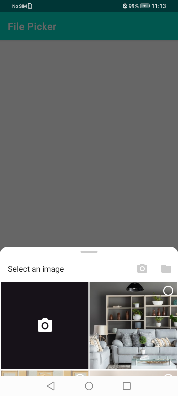
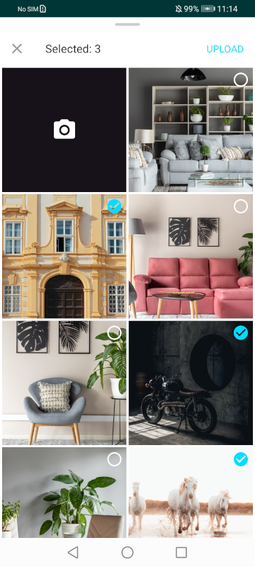

# BottomSheet File Picker for Android



## Based on / thanks to:
* [BottomSheet Image Picker](https://github.com/kroegerama/bottomsheet-imagepicker) by kroegerama
* [ChiliPhotoPicker](https://github.com/ChiliLabs/ChiliPhotoPicker) by ChiliLabs

## Key features
* Single or multiselect for images
* Can use camera to take a picture
* Can also pick any files via SAF (configured with mimetypes)
* Android 10+ support, pure Kotlin (minSDK 21)
* Image library independent (included samples for Coil and Glide)

## Setup
Sorry, there are no public library yet. Download code, compile `aar` and include to you project yourself

### Step 1: Create your own FileProvider
Just follow the guide from [Official Android Document](https://developer.android.com/reference/android/support/v4/content/FileProvider#ProviderDefinition).
See the demo application [provider_paths.xml](app/src/main/res/xml/provider_paths.xml) and [AndroidManifest.xml](app/src/main/AndroidManifest.xml).

### Step 2: Initialize library
Initialize `FilePicker` in your `Application`'s class `onCreate`
- `loader` - your preferred `ImageLoader` implementation (ready examples for Glide and Coil are [here](app/src/main/java/ru/sash0k/filepicker/demo/loaders/))
- `authority` - your file provider authority. Is needed if you configure `cameraButton(enabled = true)` so picker could take temporary photo from camera
``` kotlin
FilePicker.init(
    loader = GlideImageLoader(),
    authority = "${BuildConfig.APPLICATION_ID}.provider"
)
```

### Step 3: Create the picker using the Builder
The setters are all **optional** and the builder will fallback to default values.
``` kotlin
BottomSheetImagePicker.Builder()
    .requestTag(tag)
    .multiSelect()                                                      // enables multiselect mode
    .cameraButton(enabled = true)                                       // enables camera
    .storageButton(mimeTypes = arrayOf("image/*", "application/pdf"))   // enables SAF for mimeTypes
    .show(childFragmentManager)                                         // inside activity use supportFragmentManager
```

### Step 4: Implement the callback handler
The caller Activity or Fragment has to implement `BottomSheetImagePicker.OnImagesSelectedListener` to receive the selection callbacks. It will automatically be used by the picker.
``` kotlin
override fun onImagesSelected(uris: List<Uri>, tag: String?) {
    TODO("your implementation")
}
```

### License
```
    Licensed under the Apache License, Version 2.0 (the "License");
    you may not use this file except in compliance with the License.
    You may obtain a copy of the License at

       http://www.apache.org/licenses/LICENSE-2.0

    Unless required by applicable law or agreed to in writing, software
    distributed under the License is distributed on an "AS IS" BASIS,
    WITHOUT WARRANTIES OR CONDITIONS OF ANY KIND, either express or implied.
    See the License for the specific language governing permissions and
    limitations under the License.
```